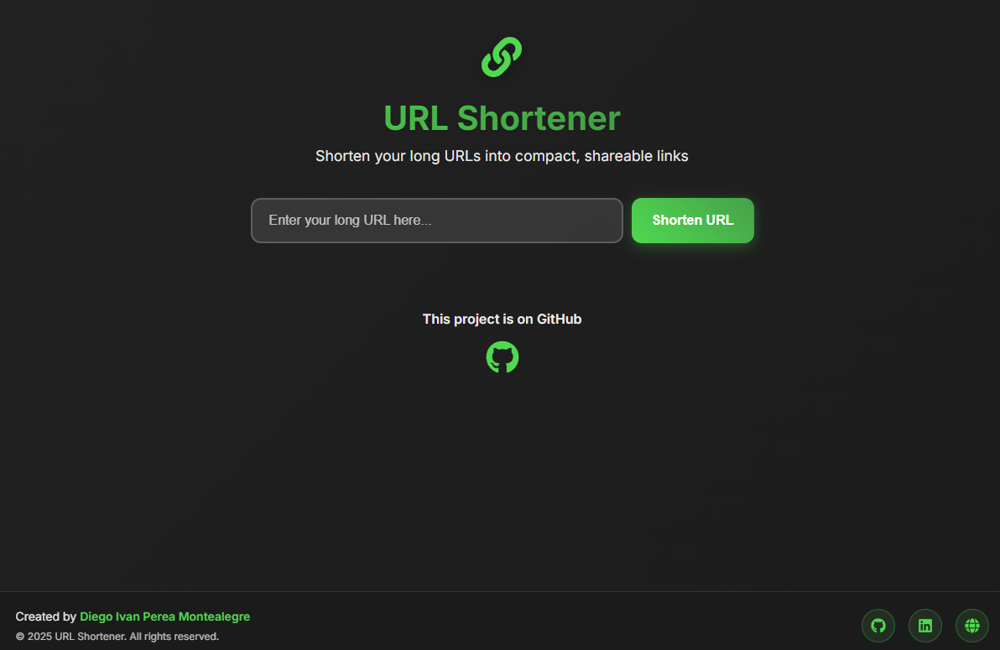

# URL Shortener

<p align="center">
  
  <br>
  <em>Home</em>
</p>

A modern, fast, and user-friendly URL shortener built with Next.js 14. Transform your long URLs into compact, shareable links instantly.


## ✨ Features

- **🚀 Fast & Modern**: Built with Next.js 14 and React 18
- **📱 Responsive Design**: Works perfectly on desktop, tablet, and mobile
- **🎨 Beautiful UI**: Modern glassmorphism design with smooth animations
- **🔗 Instant Shortening**: Create short URLs in seconds
- **📋 Copy to Clipboard**: One-click copy functionality
- **✅ URL Validation**: Ensures only valid URLs are processed
- **🔄 Real-time Feedback**: Loading states and error handling
- **🌐 SEO Optimized**: Proper meta tags and Open Graph support
- **♿ Accessibility**: WCAG compliant with proper ARIA labels

## 🛠️ Tech Stack

- **Frontend**: Next.js 14, React 18, CSS3
- **Icons**: React Icons
- **Styling**: Custom CSS with Glassmorphism effects
- **Deployment**: Vercel-ready

## 🚀 Getting Started

### Prerequisites

- Node.js 18.0.0 or higher
- npm 8.0.0 or higher

### Installation

1. **Clone the repository**

   ```bash
   git clone https://github.com/diegoperea20/Url-Shorten.git
   cd Url-Shorten
   ```

2. **Install dependencies**

   ```bash
   npm install
   ```

3. **Run the development server**

   ```bash
   npm run dev
   ```

4. **Open your browser**
   Navigate to [http://localhost:3000](http://localhost:3000)

### Building for Production

```bash
# Build the application
npm run build

# Start the production server
npm start
```

## 📁 Project Structure

```
Url-Shorten/
├── src/
│   ├── app/
│   │   ├── api/
│   │   │   └── shorten/
│   │   │       └── route.js          # API endpoints
│   │   ├── globals.css               # Global styles
│   │   ├── layout.js                 # Root layout
│   │   └── page.js                   # Main page component
│   └── components/
│       ├── Footer.jsx                # Footer component
│       └── footer.css                # Footer styles
├── public/
│   └── icon.ico                      # App icon
├── package.json
└── README.md
```

## 🔧 API Endpoints

### POST `/api/shorten`

Creates a shortened URL.

**Request Body:**

```json
{
  "url": "https://example.com/very-long-url"
}
```

**Response:**

```json
{
  "shortCode": "abc123",
  "originalUrl": "https://example.com/very-long-url",
  "message": "URL shortened successfully"
}
```

### GET `/api/shorten?shortCode=abc123`

Retrieves the original URL for a short code.

**Response:**

```json
{
  "url": "https://example.com/very-long-url",
  "shortCode": "abc123"
}
```

## 🎨 Customization

### Styling

The application uses custom CSS with modern design principles. You can customize the appearance by modifying:

- `src/app/globals.css` - Main styles
- `src/components/footer.css` - Footer styles

### Configuration

Update the metadata in `src/app/layout.js` to customize:

- Page title and description
- Open Graph tags
- Favicon

## 🚀 Deployment

### Vercel (Recommended)

1. Push your code to GitHub
2. Connect your repository to Vercel
3. Deploy automatically


## 🤝 Contributing

1. Fork the repository
2. Create your feature branch (`git checkout -b feature/AmazingFeature`)
3. Commit your changes (`git commit -m 'Add some AmazingFeature'`)
4. Push to the branch (`git push origin feature/AmazingFeature`)
5. Open a Pull Request

## 📝 License

This project is licensed under the MIT License - see the [LICENSE](LICENSE) file for details.

## 👨‍💻 Author

**Diego Ivan Perea Montealegre**

- GitHub: [@diegoperea20](https://github.com/diegoperea20)
- LinkedIn: [Diego Ivan Perea Montealegre](https://www.linkedin.com/in/diego-perea-montealegre)
  
---

⭐ If you found this project helpful, please give it a star on GitHub!
